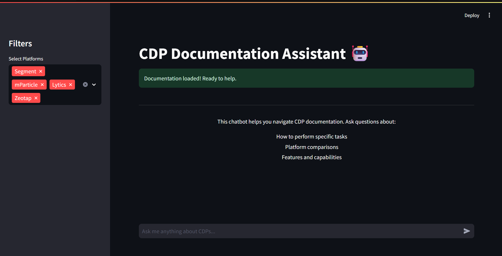

# CDP Documentation Chatbot

A comprehensive chatbot that helps users navigate and understand documentation from multiple Customer Data Platforms (CDPs). The project includes a web scraper to gather documentation and a Streamlit-based chat interface.



## Features

### Created Custom Web-Scraper for Docs
- Scrapes documentation from multiple CDP platforms:
  - Segment
  - mParticle
  - Lytics
  - Zeotap
- Structures data with metadata and categories
- Extracts step-by-step instructions
- Identifies content types and difficulty levels
- Saves data in JSON format for easy access

### Chatbot Interface
- Interactive chat UI built with Streamlit
- Natural language question handling
- Platform comparison capabilities
- Step-by-step instruction extraction
- Real-time responses
- Chat history maintenance
- Platform filtering options

## Installation

1. Clone the repository:
```bash
git clone <repository-url>
cd cdp-chatbot
```

2. Create and activate a virtual environment (recommended):
```bash
# Windows
python -m venv venv
.\venv\Scripts\activate

# Linux/Mac
python3 -m venv venv
source venv/bin/activate
```

3. Install required packages:
```bash
pip install -r requirements.txt
```

## Required Libraries

```txt
# Web Scraping
requests==2.31.0
beautifulsoup4==4.12.2
urllib3==2.0.7

# Data Processing
scikit-learn==1.2.2
numpy==1.24.3
pandas==2.0.3

# Web Interface
streamlit==1.24.0

# Utilities
python-dotenv==1.0.0
tqdm==4.65.0
```

## Project Structure

```
cdp-chatbot/
├── scraper/
│   ├── __init__.py
│   └── cdp_scraper.py
├── app/
│   ├── __init__.py
│   └── app.py
├── cdp_docs/
│   ├── segment_docs.json
│   ├── mparticle_docs.json
│   ├── lytics_docs.json
│   └── zeotap_docs.json
├── requirements.txt
└── README.md
```

## Usage

Running the Chatbot

Start the Streamlit application:
```bash
streamlit run app/app.py
```

The chatbot can handle:
- How-to questions (e.g., "How do I set up a new source in Segment?")
- Comparison questions (e.g., "How does Segment's audience creation compare to Lytics?")
- Feature-specific questions
- General platform questions

## Error Handling

The application includes comprehensive error handling for:
- Missing documentation files
- Invalid JSON data
- Network issues during scraping
- Empty or invalid queries
- Processing errors

## Troubleshooting

Common issues and solutions:

1. **Missing Documentation**
   - Ensure the scraper has been run successfully
   - Check the `cdp_docs` directory exists
   - Verify JSON files are present and valid

2. **Scraper Issues**
   - Check network connectivity
   - Verify access to CDP documentation sites
   - Review rate limiting settings

3. **Chatbot Problems**
   - Confirm all required packages are installed
   - Verify Python version compatibility
   - Check Streamlit installation

---
For more information about the CDPs covered:
- [Segment Documentation](https://segment.com/docs/)
- [mParticle Documentation](https://docs.mparticle.com/)
- [Lytics Documentation](https://docs.lytics.com/)
- [Zeotap Documentation](https://docs.zeotap.com/)
